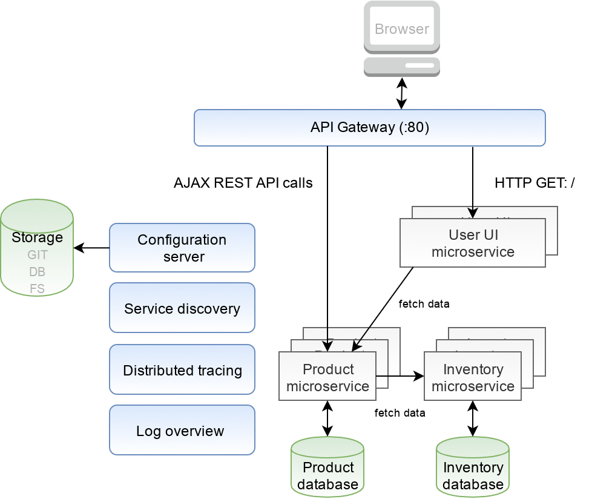

# simpleshop-spring-cloud-example
Proof-of-Concept implementation of cloud scalable simple e-commerce.

## [1. basic business decomposition](https://github.com/petrfilip/simpleshop-spring-cloud-example/tree/1-decomposition)
- split into two module (product, inventory)
## [2. external configuration](https://github.com/petrfilip/simpleshop-spring-cloud-example/tree/2-external-config)
- file-system support (native)

