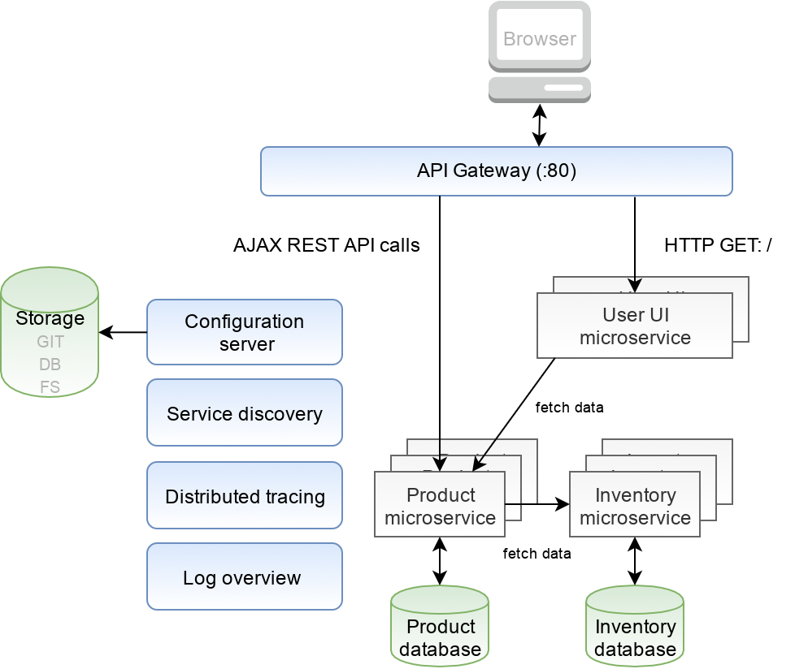
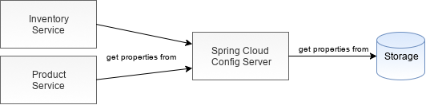
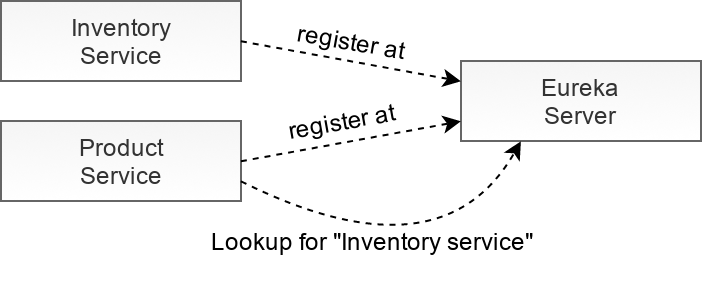
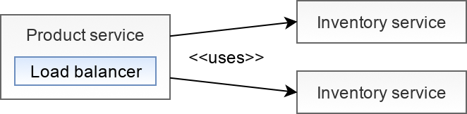
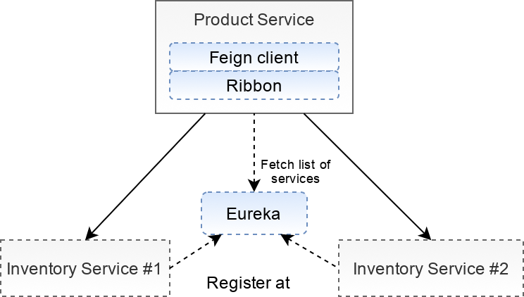
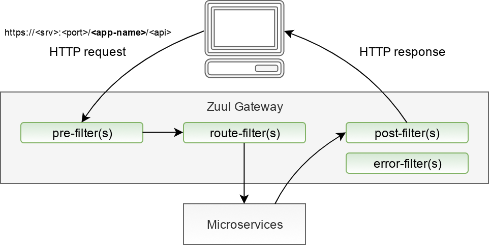

# Simple examples of implementation of Spring Cloud
Proof-of-Concept implementation of cloud scalable simple e-commerce.

## Final architecture

### [1. basic business decomposition](https://github.com/petrfilip/simpleshop-spring-cloud-example/tree/1-decomposition)
- split into two module (product, inventory)

### [2. external configuration](https://github.com/petrfilip/simpleshop-spring-cloud-example/tree/2-external-config)
- file-system support (native)

### [3. service discovery](https://github.com/petrfilip/simpleshop-spring-cloud-example/tree/3-service-discovery)

### [4. service discovery & random port](https://github.com/petrfilip/simpleshop-spring-cloud-example/tree/4-server-port-zero-and-discovery-service-problem)

### [5. client-side load balancing](https://github.com/petrfilip/simpleshop-spring-cloud-example/tree/5-client-side-balancing-ribbon-with-eureka)

### [6. circuit breaker](https://github.com/petrfilip/simpleshop-spring-cloud-example/tree/6-circuit-breaker-hystrix)

### [7. API gateway](https://github.com/petrfilip/simpleshop-spring-cloud-example/tree/7-edge-service-api-gateway)

